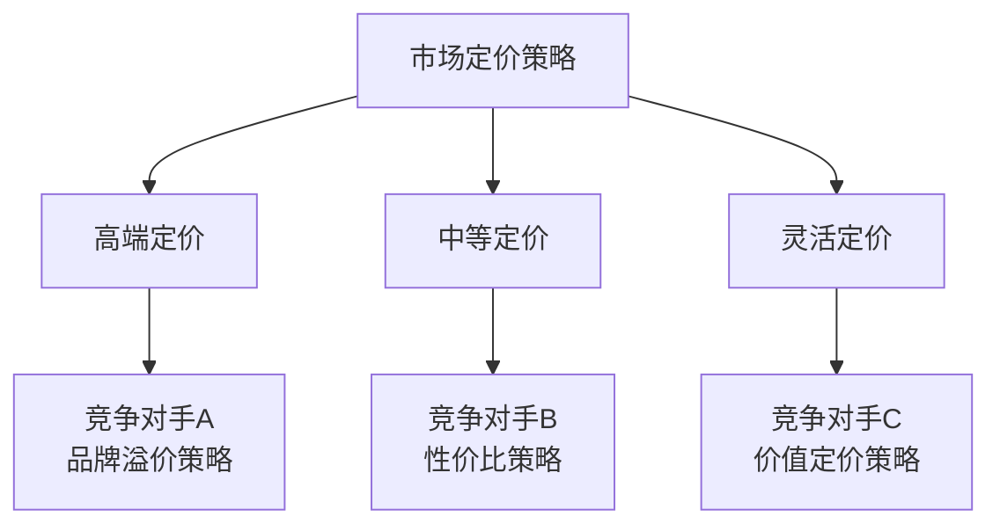

# 竞争对手市场策略分析报告

## 📊 执行摘要

本报告对主要竞争对手的市场策略进行了深入分析，识别了关键的竞争优势、市场定位策略以及潜在的市场机会。分析结果将为我们的战略决策提供重要参考。

---

## 🎯 分析目标

- 识别主要竞争对手的核心竞争策略
- 分析竞争对手的市场定位和目标客户群
- 评估竞争对手的产品/服务优势与劣势
- 发现市场空白和机会点
- 为我们的差异化策略提供建议

---

## 🏢 主要竞争对手概览

### 竞争对手A
**公司名称**: [待填入具体公司名]
**市场地位**: 行业领导者
**核心优势**: 
- 品牌知名度高
- 技术实力雄厚
- 渠道覆盖广泛

### 竞争对手B
**公司名称**: [待填入具体公司名]
**市场地位**: 快速增长的挑战者
**核心优势**:
- 创新能力强
- 用户体验优秀
- 价格竞争力强

### 竞争对手C
**公司名称**: [待填入具体公司名]
**市场地位**: 细分市场专家
**核心优势**:
- 专业化程度高
- 客户关系稳固
- 服务质量优异

---

## 📈 市场策略分析

### 1. 产品策略对比

| 竞争对手 | 产品定位 | 核心功能 | 差异化特点 | 价格策略 |
|---------|---------|---------|-----------|---------|
| 竞争对手A | 高端全功能 | 完整解决方案 | 技术领先 | 高价策略 |
| 竞争对手B | 性价比优选 | 核心功能突出 | 用户友好 | 中等价位 |
| 竞争对手C | 专业定制 | 行业特化 | 深度定制 | 灵活定价 |

### 2. 营销策略分析

#### 竞争对手A的营销策略
- **渠道策略**: 多渠道布局，线上线下并重
- **推广方式**: 大规模品牌广告投入
- **客户获取**: 依靠品牌影响力和口碑传播
- **客户留存**: 完善的客户服务体系

#### 竞争对手B的营销策略
- **渠道策略**: 以数字化渠道为主
- **推广方式**: 精准营销和内容营销
- **客户获取**: 社交媒体和KOL合作
- **客户留存**: 产品迭代和用户社区建设

#### 竞争对手C的营销策略
- **渠道策略**: 直销和合作伙伴渠道
- **推广方式**: 行业展会和专业媒体
- **客户获取**: 专业推荐和案例展示
- **客户留存**: 深度服务和长期合作

### 3. 定价策略对比

---

## 🔍 SWOT分析

### 竞争对手A
**优势 (Strengths)**
- 市场领导地位稳固
- 技术研发实力强
- 品牌认知度高
- 资金实力雄厚

**劣势 (Weaknesses)**
- 产品价格偏高
- 创新速度相对较慢
- 对新兴市场反应不够敏捷

**机会 (Opportunities)**
- 国际市场扩张
- 新技术应用
- 产业链整合

**威胁 (Threats)**
- 新兴竞争对手崛起
- 技术变革冲击
- 监管政策变化

### 竞争对手B
**优势 (Strengths)**
- 产品创新能力强
- 用户体验优秀
- 市场反应速度快
- 成本控制能力强

**劣势 (Weaknesses)**
- 品牌影响力有限
- 资源相对不足
- 市场覆盖面窄

**机会 (Opportunities)**
- 细分市场深耕
- 技术差异化
- 合作伙伴拓展

**威胁 (Threats)**
- 大厂商价格战
- 资金链压力
- 人才流失风险

---

## 📊 关键发现与洞察

### 1. 市场趋势洞察
- **数字化转型加速**: 所有竞争对手都在加大数字化投入
- **用户体验重要性提升**: 产品易用性成为关键竞争因素
- **个性化需求增长**: 定制化解决方案需求上升
- **生态化竞争**: 从单一产品竞争转向生态系统竞争

### 2. 竞争格局变化
- 市场集中度在提高，头部效应明显
- 新技术应用成为差异化关键
- 客户忠诚度下降，转换成本降低
- 跨界竞争者增多

### 3. 客户行为变化
- 决策过程更加理性化
- 对性价比要求提高
- 服务质量期望上升
- 多渠道比较购买行为增加

---

## 🎯 战略建议

### 1. 差异化定位建议
- **技术创新**: 在核心技术领域实现突破
- **服务差异化**: 提供更加个性化的服务体验
- **细分市场**: 专注于特定细分市场的深度需求
- **生态建设**: 构建完整的产品生态系统

### 2. 竞争策略建议
- **避实击虚**: 避开竞争对手的强势领域
- **快速响应**: 建立敏捷的市场响应机制
- **合作共赢**: 寻找与竞争对手的合作机会
- **持续创新**: 保持产品和服务的持续创新

### 3. 市场进入策略
- **渐进式进入**: 从细分市场开始逐步扩张
- **合作伙伴**: 通过战略合作快速获得市场份额
- **差异化价值**: 提供独特的价值主张
- **品牌建设**: 加强品牌认知和影响力建设

---

## 📋 行动计划

### 短期行动 (1-3个月)
- [ ] 完善产品功能，提升用户体验
- [ ] 制定针对性的营销策略
- [ ] 建立竞争对手监控机制
- [ ] 优化定价策略

### 中期行动 (3-12个月)
- [ ] 推出差异化产品功能
- [ ] 扩大市场覆盖范围
- [ ] 建立合作伙伴网络
- [ ] 加强品牌建设投入

### 长期行动 (1-3年)
- [ ] 构建完整的产品生态
- [ ] 实现技术领先优势
- [ ] 建立行业影响力
- [ ] 探索国际市场机会

---

## 📈 关键指标监控

### 市场份额指标
- 整体市场份额变化
- 细分市场份额对比
- 新客户获取率
- 客户流失率

### 竞争力指标
- 产品功能对比评分
- 客户满意度对比
- 品牌认知度调研
- 价格竞争力指数

### 财务指标
- 收入增长率对比
- 利润率对比
- 市场投入回报率
- 客户获取成本

---

## 🔄 持续更新机制

本分析报告将定期更新，建议：
- **月度更新**: 关键指标和市场动态
- **季度更新**: 竞争策略和产品变化
- **年度更新**: 全面的战略分析和调整

---

## 📝 附录

### 数据来源
- 公开财务报告
- 行业研究报告
- 客户调研数据
- 市场监测数据
- 专家访谈记录

### 分析方法
- SWOT分析法
- 波特五力模型
- 价值链分析
- 竞争定位图
- 客户旅程分析

---

**报告编制**: 团队市场分析小组  
**编制日期**: 2024年12月  
**下次更新**: 2025年3月  
**版本**: v1.0

---

> 💡 **提示**: 本报告为团队内部使用，请妥善保管相关信息。如需分享给外部人员，请先获得相关授权。